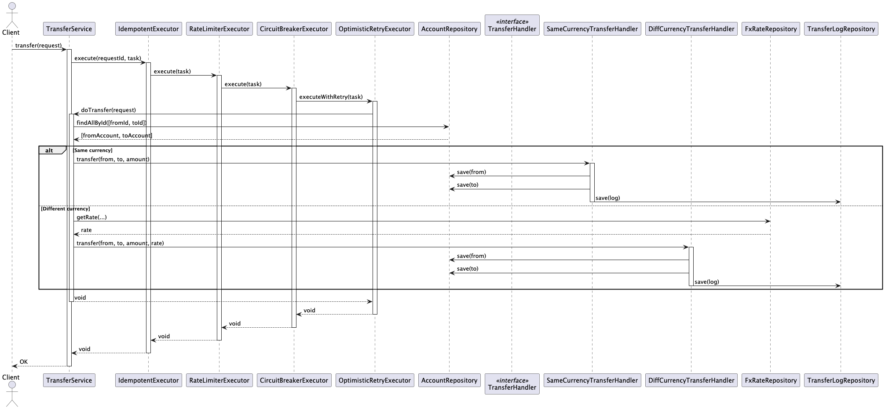

# Money Transfer System

## Table of Contents

- [Overview](#overview)
- [Details](#details)
- [Init Data](#predefined-accounts)
- [Project Structure](#project-structure)
- [How to Run](#how-to-run)
- [Features](#supported-features)
- [Concurrency Strategy](#concurrency-strategy)
- [Test Scenarios](#test-scenarios)
- [Assumptions](#assumptions-made)
- [Enhancements](#possible-enhancements)

## Overview

A production-grade Java Spring Boot application that simulates a **concurrent-safe** money transfer system between
accounts using an in-memory H2 database.

## Details

- Money can be transferred to an account only in its base currency.
- Money can only be transferred from an account in its base currency
- The FX conversion rate is 0.50 USD to 1 AUD.
- A transaction fee of 1% applies to all transfers and is charged to transaction initiator
- Implement a mechanism to handle concurrent transactions safely.

## Predefined Accounts

| ID | Name  | Balance | Currency |
|----|-------|---------|----------|
| 1  | Alice | 1000    | USD      |
| 2  | Bob   | 500     | JPN      |

#### FX Rate

- `0.50 USD` = `1 AUD`

#### Transaction Fee

- A **1% fee** is deducted from the **initiator's** account, in their base currency.

## Tech Stack

- Java 17
- Spring Boot 3.x
- H2 Database (in-memory)
- Spring Data JPA
- Maven
- JUnit + Spring Test

## Project Structure

```bash
src/
├── main/
│   ├── java/org/example/transfer/
│   │   ├── comm/
│   │   ├── config/
│   │   ├── controller/
│   │   ├── exception/
│   │   ├── executor/
│   │   ├── filter/
│   │   ├── handler/
│   │   ├── model/
│   │   ├── params/
│   │   ├── repository/
│   │   ├── service/
│   │   └── util/
│   └── resources/
│       ├── application.yml
│       ├── data.sql
│       └── log4j2-spring.xml
└── test/
    ├── java/org/example/transfer/
    │   ├── controller/
    │   ├── service/
    └── resources/
        ├── testdata/
        └── application-test.yml
```

## Sequence Diagram



## How to Run

Ensure you have Java 17 and Maven installed.

1. **Clone the repository**:
   ```bash
   git clone git@github.com:Ccbillow/MoneyTransfer.git
   cd MoneyTransfer
   ```

2. **Run project**:
   ```bash
   sh deploy.sh
   ```
3. **Access H2 Console (optional)**:
   ``` 
   http://localhost:8089/h2-console
   JDBC URL: jdbc:h2:mem:transferdb
   User: sa
   Password:
   ```

4. **API Example**:
   ```
   POST /api/transfer
   ```

    - Request Body
   ```
   {
    "fromId": 1,                 --from accountID
    "toId": 2,                   --to accountID
    "amount": 50,                --transfer amount
    "transferCurrency": "USD"    --transfer currency
   }
   ```
    - Response
   ```
   {
    "success": false,
    "errorCode": "4008",
    "errorMsg": "not support transfer type: DIFFERENT, fromCurrency:USD, toCurrency:JPN",
    "data": null
   }
   ```

## Supported Features

- Transfer in same currency.
- Transfer with FX currency auto-conversion (**Configurable**).
- Scalable transfer type.

## Concurrency Strategy

- Optimistic locking (via @Version field in JPA).
- Random wait time to retry, reduce lock contention.
- Redis-based distributed lock (if externalized).

## High-Availability Strategy

- Retry.
- Circuit Breaker.
- Rate Limiter.
- Idempotent.

## Test Scenarios

Run all tests with:

```bash
mvn clean test
```

### Assignment tests:

All scenarios are covered in unit & integration tests under src/test/java. You can use **Testcase Name** to find it.

#### If not support Currency conversion

| Scenario Description                                     | Testcase Name                                                                                                                                                | Error Msg                                                                                                                                                 |
|----------------------------------------------------------|--------------------------------------------------------------------------------------------------------------------------------------------------------------|-----------------------------------------------------------------------------------------------------------------------------------------------------------|
| ```testTransferUSDFromAliceToBob_Fail```                 | Transfer 50 USD to Alice to Bob                                                                                                                              | not support transfer type: DIFFERENT, fromCurrency:USD, toCurrency:JPN                                                                                    |
| ```testTransferAUDFromBobToAlice20Times_Fail```          | Transfer 50 AUD to Bob to Alice recurring for 20 times (diff requestId)                                                                                      | Sender must use base currency.                                                                                                                            |
| ```testTransferAUDFromBobToAliceSameReqId20Times_Fail``` | Transfer 50 AUD to Bob to Alice recurring for 20 times (same requestId)                                                                                      | 1:Sender must use base currency.<br> 19:duplicate request!                                                                                                |
| ```testConcurrentTransfer_Fail```                        | Concurrently <br> 3.1. Transfer 20 AUD from Bob to Alice<br> 3.2. Transfer money from 40 USD  Alice to bob<br> 3.3. Transfer money from 40 CNY  Alice to bob | 1. Sender must use base currency.<br> 2. not support transfer type: DIFFERENT, fromCurrency:USD, toCurrency:JPN<br> 3. Sender must use base currency.<br> |

#### If support Currency conversion

| Scenario Description                                    | Testcase Name                                                                                                                                                                         | Error Msg                                                                                        |
|---------------------------------------------------------|---------------------------------------------------------------------------------------------------------------------------------------------------------------------------------------|--------------------------------------------------------------------------------------------------|
| ```testDiffTypeTransferUSDFromAliceToBob_Fail```        | Transfer 50 USD to Alice to Bob                                                                                                                                                       | not support rate!                                                                                |
| ```testDiffTypeTransferAUDFromBobToAlice20Times_Fail``` | Transfer 50 AUD to Bob to Alice recurring for 20 times                                                                                                                                | Sender must use base currency.                                                                   |
| ```testDiffTypeConcurrentTransfer_Fail```               | Concurrently <br> 3.1. Transfer 20 AUD from Bob to Alice<br> 3.2. Transfer money from 40 USD  Alice to bob<br> 3.3. Transfer money from 40 CNY  Alice to bob                          | 1. Sender must use base currency.<br> 2. not support rate!<br> 3. Sender must use base currency. |
| ```testTransferUSDFromAliceToBob_Success```             | Transfer 50 AUD to Bob to Alice recurring for 20 times (fxRate[USD->JPN] exist)                                                                                                       | success                                                                                          |
| ```testConcurrentTransfer_Success```                    | Concurrently (fxRate[USD->JPN] exist) <br> 5.1. Transfer 20 AUD from Bob to Alice<br> 5.2. Transfer money from 40 USD  Alice to bob<br> 5.3. Transfer money from 40 CNY  Alice to bob | 1. Sender must use base currency.<br> 2. success<br> 3. Sender must use base currency.           |

### Performance tests

All performance tests are based on **same-currency transfers**. The following scenarios are tested:

| Testcase Name                                 | Scenario Description            | Result                                             |
|-----------------------------------------------|---------------------------------|----------------------------------------------------|
| ```testConcurrentTransferMoney_Success```     | Concurrent transfers            | final balances are correct                         |
| ```testLowConcurrentTransferRetry_Success```  | Low concurrency (5 threads)     | all transfers succeed after retries                |
| ```testMidConcurrentTransferRetry_Success```  | Medium concurrency (50 threads) | all transfers succeed after retries                |
| ```testHighConcurrentTransferRetry_Fail```    | High concurrency (1000 threads) | some transfers fail after exceeding 3 retries      |
| ```testCircuitBreakerOpenState```             | Circuit breaker                 | Circuit breaker triggers successfully              |
| ```testRateLimiter```                         | Rate limiter                    | Rate limiter blocks excessive requests as expected |
| ```testIdempotent_DuplicateRequestRejected``` | Idempotent                      | Same requestId, only one can success               |

### Postman/JMeter

#### Postman

[postman-config](doc/moneytransfer.postman_collection.json)

#### JMeter

[jmeter-config](doc/TestCase3.jmx)

[jmeter-data](doc/data.csv)

### Assumptions Made

- Only base currency transfer is allowed unless explicitly enabled
- All account balances are stored with **2 decimal precision**.
- H2 database is ephemeral; restarts will reset all data.
- Cross-currency transfer is allowed only if:
    - application.yml -> **transfer.enable-different-currency-transfer = true**
    - The transfer currency matches the sender’s base currency
    - A valid fxRate to the recipient’s currency exists

### Possible Enhancements

- Separate Account to User+Account
- Get FxRate from **external service** or **Redis**
- Integrate **Redis**
    - Distributed Lock (RedisLockExecutor.java)
    - Idempotent request execution (IdempotentExecutor.java)
- Integrate **ConfigCenter** to maintain config (DEFAULT_MAX_RETRIES, FEE_RATE)
- Save request to DB after all retry times fail and send email to developer
- Replace H2 with **PostgreSQL** or **MySQL** for persistence
- Add **Swagger UI** for API docs
- Use **Global TraceId** to track
- Integrate **MessageQueue** to async transfer
- Real user **authentication / authorization** (SpringSecurity+JWT)
- Use **SpringCloud** as microservices
- Integrate **CI/CD** (Jenkins/Github Actions)

---